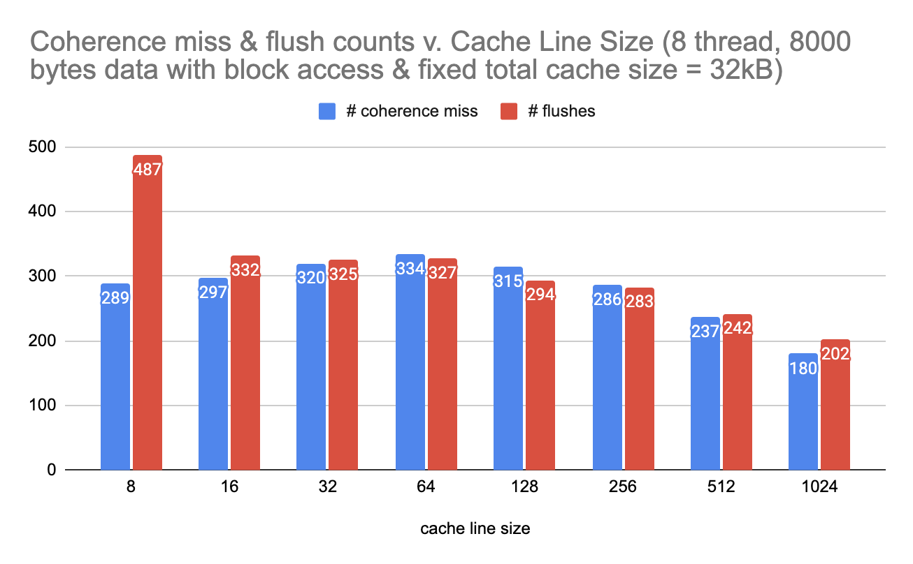
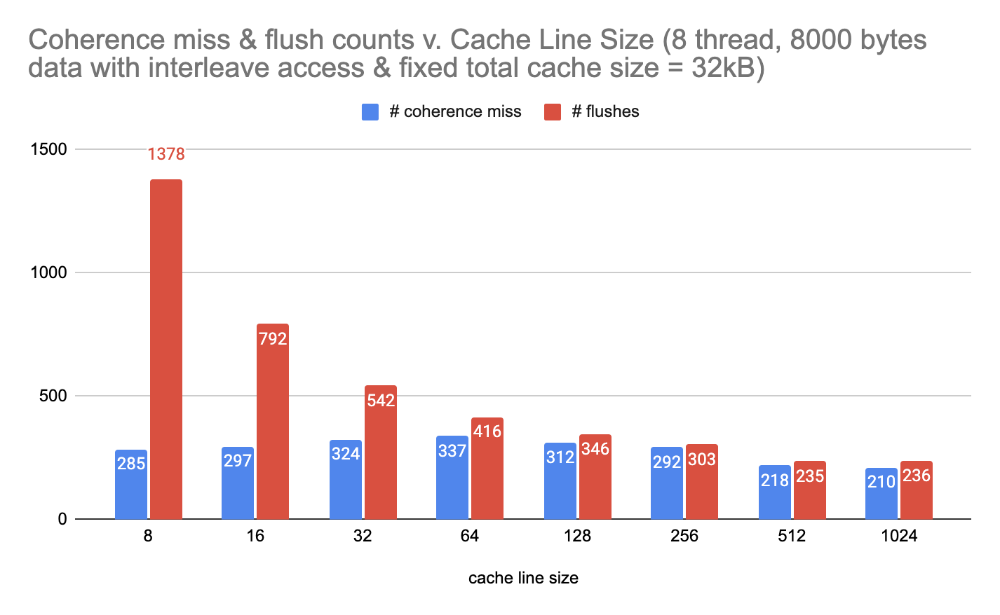
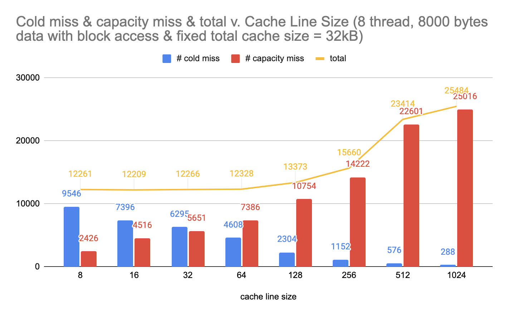

<script src="https://cdn.mathjax.org/mathjax/latest/MathJax.js?config=TeX-AMS-MML_HTMLorMML" type="text/javascript"></script>
# Snooping Based Coherence Simulator

In this project, we implement a software simulator of the Snooping Based Coherence Protocol with the basic MSI state transitions. We test the correctness of our program on the ghc77 machines using the examples from the 418 lecture first to make sure the simulator is sequentially consistent, then benchmark our simulator with programs that have different memory access patterns. Our final deliverables include graphs and analysis between the relationship among several important independent variables and dependent variables. The final trend fits our 
general prediction, which practically shows the correctness of our simulator.

# Background 

<p align="center">

</p>

In computer architecture, cache coherence is the uniformity of shared resource data that ends up stored in multiple local caches. When clients in a system maintain caches of a common memory resource, problems may arise with incoherent data, especially with CPUs with a multiprocessing system. To ensure the correctness of parallel programs, several memory coherence protocols are implemented. Among all of them the most famous ones are MSI and MESI. Design and implementation detail of the protocol greatly influences the memory usage and speed of the communication system, and in many cases we want to know when and how to choose the right protocol. However, sometimes hardwares are limited, and as students we do not have as much resources. Therefore, a software simulation program may become handy in evaluating the performance and help us choose the correct design.

## Key Data Structures 

### Cacheline 

```
struct Cacheline
{
    Cacheline():tag(nullptr), state(State::I){}
    Cacheline(void *tg):tag(tg),state(State::I){}
    int cnt;
    State state;
    void* tag;
    //char data[CachelineSize];
};
```

```cnt``` is actually the timestamp of the operation in the trace. For instance, 
```cnt = 5``` means that is the 5th row from the memory trace input. This 
is for debugging and collecting statistics only.

```tag ``` is the address of this cacheline

```State``` M = Modified, S = Shared, I = Invalid

```data[CachelineSize]``` stores the actual content of the cacheline. We do not need 
it since our simulator does not involve real data transfers. 

Notice that CachelineSize is determined at compile time.

### LRU Cache 

The LRU Cache is a polymorphic. The key is the ```void *``` type, which indicates the 64 bits memory address, the value is simply the corresponding cacheline for this address. 

Lookup API:

```Value get(Key key, bool create_new = false)```

create_new means that if the entry is not in the cache, create a new one.

Insert API:

```void put(Key key, Value value)```


Lookup(Get) and Insert(Put) is $$O(1)$$, implemented using a linked list and hash table. 

### Processor Abstraction 

```
class Processor
{
public:
    Processor():bus(nullptr), stat(){}
    ~Processor(){} 
    void mainloop();

    void add_trace(Trace trace); // resize LRU cache
    void resize(int capacity){cache.resize(capacity);} 
    
    // read and write at address with timestamp cnt 
    void read(void *addr, int cnt);
    void write(void *addr, int cnt);
    void pull_request(); // handle the bus transactions from the request queue
    void flush(void *tag);// flush from cache to memory
    LRUCache<void*, Cacheline> cache;
    Bus *bus;
    int tid; // thread id 
    std::queue<BusTransaction> requests; // request queue
    std::queue<Trace> traces; // the trace(read/write at address x) queue
    // concurrent locks
    std::mutex trace_lock;
    std::mutex request_lock;
}
```

### Bus Abstraction
```
class Bus
{
public:
    void mainloop();

    // push a PrRd/PrWr from processor t for Cacheline c
    void push(Cacheline cline, int thread_id, PrTsnType pr_request, bool is_new);

    // send a BusRd/RdX to the target processors
    void process(BusTransaction request);

    std::vector<std::shared_ptr<Processor> > processors;

    // shared request queue
    std::queue<BusTransaction> requests;
    // bus lock for concurrency
    std::mutex bus_lock;
};
```

## Sample Debug Output
```
timestamp : 1  tid : 0 address : 0x10000000 BusRd  
processors : 0
 Shared   0x10000000

processors : 1
 Invalid  0x10000000

timestamp : 2  tid : 1 address : 0x10000000 BusRd  
processors : 0
 Shared   0x10000000

processors : 1
 Shared   0x10000000

timestamp : 3  tid : 0 address : 0x10000000 BusRdX 
processors : 0
 Modified 0x10000000

processors : 1
 Shared   0x10000000

timestamp : 4  tid : 0 address : 0x10000000 BusRdX 
processors : 0
 Modified 0x10000000

processors : 1
 Invalid  0x10000000

coherence miss! by 1
timestamp : 5  tid : 1 address : 0x10000000 BusRdX 
processors : 0
 Modified 0x10000000

processors : 1
 Invalid  0x10000000

coherence miss! by 0
timestamp : 7  tid : 0 address : 0x10000000 BusRd  
processors : 0
 Shared   0x10000000

processors : 1
 Invalid  0x10000000

timestamp : 8  tid : 0 address : 0x10000000 BusRdX 
processors : 0
 Modified 0x10000000

processors : 1
 Invalid  0x10000000

coherence miss! by 1
timestamp : 6  tid : 1 address : 0x10000000 BusRd  
processors : 0
 Modified 0x10000000

processors : 1
 Invalid  0x10000000

timestamp : 10  tid : 0 address : 0x10000400 BusRd  
processors : 0
 Shared   0x10000400

 Shared   0x10000000

processors : 1
 Invalid  0x10000000

timestamp : 11  tid : 0 address : 0x10000400 BusRdX 
processors : 0
 Modified 0x10000400

 Shared   0x10000000

processors : 1
 Invalid  0x10000000

coherence miss! by 1
timestamp : 9  tid : 1 address : 0x10000000 BusRd  
processors : 0
 Modified 0x10000400

 Shared   0x10000000

processors : 1
 Invalid  0x10000400

 Shared   0x10000000

timestamp : 12  tid : 1 address : 0x10000400 BusRdX 
processors : 0
 Modified 0x10000400

 Shared   0x10000000

processors : 1
 Modified 0x10000400

 Shared   0x10000000

-----Processor 0-----
cold misses : 2
capacity misses : 0
coherence misses : 1
flush : 3
-----Processor 0-----
-----Processor 1-----
cold misses : 2
capacity misses : 0
coherence misses : 3
flush : 1
-----Processor 1-----
```


# Approach

## Real Process Overview

### 1. Program ==> Trace
(Interleave access of 64 threads on array length of 256)
```
void *thread(void *cur_args) {
    
    args *casted = (args*)cur_args;
    for (int i = 0; i < 4; i++){
        casted->arr[casted->tid + i * 64] += 1;
    }

    pthread_exit(NULL);
}
```
==>
```
0x400c58: W 0x7fff1c83cfc0; TID: 31527
0x400c66: W 0x7fff1c83cfb8; TID: 31527
0x400c1b: W 0x7fff1c83cfb0; TID: 31527
0x400c23: W 0x7fff1c83cfac; TID: 31527
0x400c26: W 0x7fff1c83cfa8; TID: 31527
0x400c29: R 0x7fff1c83cfac; TID: 31527
0x400c2f: R 0x7fff1c83cfa8; TID: 31527
0x400c3d: W 0x7fff1c83cf98; TID: 31527
0x400830: R 0x602030; TID: 31527
0x400836: W 0x7fff1c83cf90; TID: 31527
0x4007f0: R 0x602008; TID: 31527
0x4007f0: W 0x7fff1c83cf88; TID: 31527
0x4007f6: R 0x602010; TID: 31527
(Instruction Address) : Read/Write (Memory Address), Thread ID
...
```
### 2. Create Bus and Processors in Separate Threads
Let us say the original program has n threads, then we need n+1 threads in total.
These threads call mainloop() that actively checks if their queues are empty.
If they are not, pull out a request and start to handle the request.
Processors have two queues, one is the trace queue and another is the bustransaction
queue.

Bus only has a bustransaction queue. Whenever there are any operations on the queue,
mutex locks are applied to avoid concurrent faults. 


### 3. Feed Trace to Processors Queue 
```
bus.processors[tid]->add_trace(Trace(addr, rw_type, ++cnt));
```
Notice the inqueue time is in sequential order since the we can not read the trace file in parallel. However, since each processor is in separate thread, the actual processing of the requests among the processors are not necessarily obeying the 
sequential trace order. The order inside each processor is still correct since the queue is FIFO. We believe that, within our range of abilities, this is the most accurate presentation of the data access pattern in real applications.

### 4. Processor Read and Write

Before any other actions, processor locks the bustransaction queue and handle the 
bus transactions(originated in other processors) first until the bus transaction queue is empty. 

This process followed
the MSI diagram. 
A ```BusRd``` makes the state to change from Modified to Shared, ```BusRdX``` may make some cacheline invalid, etc. 

Then, the processor updates its local LRU Cache accordingly.

Finally, the processor calles the Bus to push ```PrRd``` or ```PrWr``` on to the bus transaction queue of the Bus. The Bus will obtain a bus lock on the queue, generates corresponding Bus transaction, and sends the transaction to every other processor. The other processors must handle all the bus transactions in their queue, in the very beginning of the next read or write operations as described in the first paragraph of this section.
## Other Side Details
### Cacheline Mapping 
```#define convert(x) (void*)((long long)(addr) / CachelineSize * CachelineSize)```

For instance, let us say the cacheline size is 16 bit. 
Then address from 64 to 79 will be mapped to 64 and they will be in the same 
cacheline.


### Intel Pin Tools

We use a self-modified version of the memory trace tool in pin called `pinatrace`. 

Originally, the tool `pinatrace` is used to record all the read and write instructions that happen between both memory and registers. The output file from `pinatrace` includes the address of the instruction, the address of memory access, and the type of access (write or read). The output trace file of `pinatrace` contains large amounts of information that is not needed in our project, therefore we manipulated the original tool to achieve what we need. 

First, we define two functions, `startroi()` and `stoproi()` as follows:

```
void startroi(void) {}
void stoproi(void) {}
```

In the input program, we insert calls to these two functions around the region of code that we want the pin tool to instrument. In our modified pintool program file, a flag named `isROI` is used. When a routine is found to contain the substring `startroi` in it, `isROI` is set to be `true` indicating the start of the region that we want the pintool to start printing out the trace. When a routine containing substring `stoproi` is encountered, the flag `isROI` is set to be `false`, ending the trace printing. 

Second, we notice that `pinatrace` also prints out the read and write traces between registers, which is the information that we do not need, since data on registers are not using cache. Therefore, we use the pin function `INS_OperandIsReg` to filter out read or write between registers. 

Third, we use the pin function `PIN_GetTid` to obtain the thread id of the current instruction, since this is also the information we need to pass for the later part of our project.

### Parallelism 
 We use posix thread(pthread) for both the input program and the MSI simulator. The process is just creating different pthreads using `pthread_create` in the beginning and waiting them to join in the end.


# Results && Analysis

There are so many independent and dependent variables availble for our cache simulator, hence we only selected some of interest.

## Dependent variables 
### number of cold misses 
Measured in LRU Cache.
If a lookup does not find entry in the cache, that is a cold miss. 
### number of capacity misses 
Measured in LRU Cache.
If an insert evicts an entry, that is a capacity miss.
### number of coherence misses 
Measured in ```bus::push()```

A coherence misses whenever a cacheline changes from invalid state to 
shared or modified state, AND the cacheline is not new to the cache, because there are implicit and temporal invalid start state for cachelines that the cache does not have.

### number of flushes 
Measured in ```processor::pull_request()```

A flush happenes whenever a cacheline changes from modified state to the 
shared or invalid state. This is kind of the opposite from coherence miss.

## Independent variables 

### Number of Processors(Threads)

Range from 2 to 64. Since in Snooping-Based Caching, communication complexity scales squarely with the number of threads. 64 is a realistic and feasible upperbound for us.

### Number of Cachelines
How big a cache in a single processor is? This affects the number of cold and capacity misses most.
### The Cacheline size
How many bytes a cacheline has? Our defaults and center point is 64 bytes.

### The Original Program itself
How big is the array? What is the intensity of contentions in our program?
What is the data access pattern? Block or Interleave, or more complex pattern?

## Experiments Configurations && Graphs
Our main program is to using different thread to access the array element and modify it. One division is blocking and another division is interleaving. Our default setting is 64 bytes and 512 cache lines, so the total cache size is 32KB which is close to the real L1 cache configurations.

In both programs, an array of size `arr_size` is created before all the threads are created. Each thread will be accessing some part of `casted->arr` by both reading and writing data. 

The thread function of interleaving data access program is written as the follows, each thread taking care of the data stored separated by a step size of `threadNum`:

```
for (int i = 0; i < arr_size / threadNum; i++){
    casted->arr[casted->tid + i * threadNum] += 1;
}
```

The thread function of blocked data access program is written as the follows, each thread taking care of the block of continuous data of size of `arr_size / threadNum`:
```
for (int i = 0; i < arr_size / threadNum; i++){
    casted->arr[casted->tid * (arr_size / threadNum) + i] += 1;
}
```

### Experiment 1
For our first experiment with our independent variable, we increment the cache line size by a factor of 2 everytime while keeping the total size of the cache to be fixed, which is 32KB.

In the following two graphs, we record the changes in number of coherences misses and flushes as we increase the cache line size from 8 bytes to 1024 bytes for two different data access pattern, blocked and interleaving. 

Since the total cache size is fixed, as the cache line size increases, the number of cache lines decrease in correspondence. For example, when the cache line increases from 8 bytes to 16 bytes, the number of cache lines decrease from 4096 to 2048.

<p align="center">

</p>
<em> <sub> figure 1. Under blocked data access, number of coherence misses and flushes vs. cache line size in fixed cache size </sub> </em>

<p align="center">

</p>
<em> <sub> figure 2. Under interleaving data access, number of coherence misses and flushes vs. cache line size in fixed cache size </sub> </em>

The first observation is that as the cache line size increases and the number of cache line decreases, the total number of flushes also decrease. Since the number of cache lines decreases, there are less opportunities for flushes to occur.

The second observation is that although the total number of flushes is decreasing, it is obvious that the first derivation (the speed of decreasing) is decreasing as well. We hypothesize that this is due to **more false sharing with larger cacheline size**.

The third observation is that under interleaving data access, when the cache line size is small, the number of flushes is almost tripled the amount of number of flushes under blocked data access. Under the interleaving data access pattern, multiple threads could be trying to access (read or write) the same cache line. Therefor the number of flushes for interleaving pattern is much higher than that of blocked pattern. 

This phenomenon diminishes as the cache line size increases, because now under interleaving pattern, the same thread can access more than one element from the array before invalidation (therefore flushes) happens. 

<br>

In the following two graphs, we record the changes in cold and capacity misses as we increase the cache line size from 8 bytes to 1024 bytes for two different data access pattern, blocked and interleaving.

<p align="center">

</p>
<em> <sub> figure 3. Under blocked data access, number of cold and capacity misses vs. cache line size in fixed cache size </sub> </em>

<p align="center">

</p>
<em> <sub> figure 4. Under interleaving data access, number of cold and capacity misses vs. cache line size in fixed cache size </sub> </em>

The first observation here is that for both access patterns, the number of capacity misses increase by a large amount as the cache line size increases. This is due to the fact that we have less cache lines as we increase the size of each cache line, meaning that more capacity miss are likely to happen.

The second observation is that for both access patterns, the number of cold misses decrease by a large amount as the cache line size increases. This is because more data can be put into a cache line at once, decreasing the number of cold misses that could happen.

<br>

### Experiment 2
In our second experiment, we changed our program to contain 10 consecutive access (read and write) to the same position in the array. 

In the following graph, we record the number of coherence misses and flushes for two access patterns with the standard size of cache.

<p align="center">

</p>
<em> <sub> figure 5. Under standard 32KB size of cache, number of coherence misses and flushes vs. different data access patterns </sub> </em>

The first observation is that for interleaving data access, both the number of coherence misses and the number of flushes is greater than those of blocked data access. This is because under interleaving data access pattern, multiple threads could be trying to read from or write to the same cache line interleavingly, meaning that a lot more invalidations and modifying are going on. 

The second observation is that while blocked data access has roughly the equal number of coherence misses and flushes, interleaving data access has way more flushes than coherence misses. This is due to the fact that we count it as a flush when the state of the cache line is changed from modified to shared or invalid, and we count it as a coherence miss when the state is changed from invalid to shared or modified. When a processor is trying to read and write to a cache line, all other processors that share this cache line will be invalidated, meaning that the number of invalidations should be greater than the number of modifications happened. 

<br>

### Experiment 3

In our third experiment, we changed our testing input program to run on different numbers of threads, including 8, 16, and 64 threads.

In the following two graphs, we record the number of coherence misses and number of flushes for two different data access patterns versus different numbers of threads. 

*See the appendix for the whole data table for different numbers of threads. 

<p align="center">

</p>
<em> <sub> figure 6. Under standard 32KB size of cache, number of coherence misses for different data access patterns vs. different number of threads </sub> </em>

<p align="center">

</p>
<em> <sub> figure 7. Under standard 32KB size of cache, number of flushes for different data access patterns vs. different number of threads  </sub> </em>

The first observation is that for both access patterns, as the number of threads increases, the number of coherences misses and the number of flushes both increase. This is due to the fact that we have more threads that could operate on the same cache line at the same time, causing more invalidations and modifications going on. Note that both the numbers of coherence misses and flushes scale linearly with the number of threads. That is to say, when the number of threads increment by a factor of $n$, the number of coherence misses and the number of flushes both increment by a factor of $n$. 

The second observation is that while the number of coherence misses is roughly the same for both data access patterns, interleaving access has as much as double the amount of flushes of blocked access. This is due to the fact that much more invalidations are happening in the interleaving access.

# Challenge 

Our MSI simulator is highly parallel just like the real ones, which has an extremely undeterministic nature to debug and reason the correctness. Therefore we have to reference the small example from lecture to test basic sequential consistency and the general trend of different statistics to prove the correctness. 
# Future Work

- Modify this protocol to MESI or MESOI. 
- Identify the percentage of true sharing and false sharing
- Actually include data transfer for the cacheline

# Reference

- Intel Pin User Guide (https://software.intel.com/sites/landingpage/pintool/docs/98547/Pin/html/index.html#MAddressTrace)
- CMU 15418 Snooping Implementation https://www.cs.cmu.edu/afs/cs/academic/class/15418-s22/www/lectures/12_snoopimpl.pdf
- Intel Pin Instrumentation Post from StackOverflow https://stackoverflow.com/questions/32026456/how-can-i-specify-an-area-of-code-to-instrument-it-by-pintool/62405749 


# Contribution of Works

## 50%(Lingxi) - 50%(Xinyu)   ? 

## Lingxi Zhang

- Design and Implement the MSI simulator from the scratch
- Test the correctness of the simulator following the example from the 418 lecture
- Debug segfaults and concurrency errors
- Choose core statistics and come up ways of how to catch these statistics in our simulator 

## Xinyu Wu

- Find out how to convert binary program to read/write trace using Intel Pin
- Filter out registers related read or write since they are not related to cache
- Filter out as much memory access, related to library preprocessing/postprocessing, as possible by specifying a region of interest around core program
- Make the graph and table of statistics

## Together 
- Come up and benchmark test cases using different variables
- Find the common trend and source of errors/turbulance among the benchmarking output 
- Analyze and summarize our discovery  